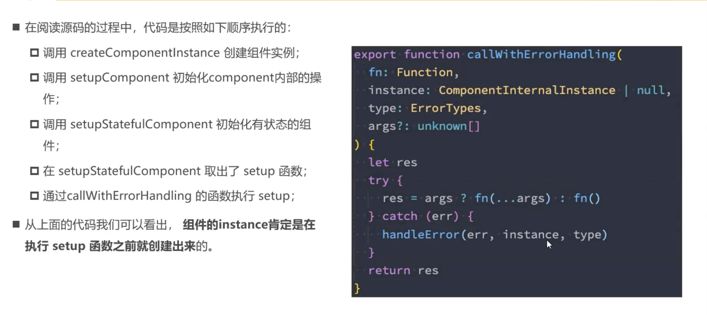

# Composition APi 学习与使用拾遗

## 定义响应式数据： reactive/ref 的应用场景

reactive 应用场景，用于保存复杂数据，对象、数组等。

1. reactive 应用于本地产生的数据，非从服务器获取的数据
2. reactive 中定义的数据有关系，是聚合的关系，组织在一起有特殊的意义，如收集一个表单内的数据，用{ username: '', password: '' }

reactive 不用于保存网络请求的数据在于：

```js
const userList = reactive([]);
const userList2 = ref([]);

onMounted(() => {
  const remoteUserList = [{id: 1, name: 'Tom'}, {id: 2, name: 'Jerry'}];

  //如果要把请求服务器的数据赋给本地的 userList，则要遍历 remoteUserList，逐个加入
  remoteUserList.forEach((item) => userList.push(item));

  // 不能直接赋值（以下做法达不到想要效果）
  userList = remoteUserList; // X

  // 用 ref 包装的数据则可以直接赋值
  userList2.value = remoteUserList;
});
```

ref 应用场景：
1. 其他场景基本都用ref，如定义本地简单数据
2. 定义从网络中获取的数据

关于ref的其他事：

- 调用 computed(() => {}) 也会返回一个 ref 对象

## 为什么setup() 函数中不能使用this？

因为vue在调用 setup() 时没有把组件实例绑定到setup()中的this，vue 调用setup() 的过程参考下图



图片来源：codewhy课程：vue3+项目实战 day59-p1049

## 模板中使用 ref 获取元素或组件

声明一个ref对象，将它绑定到元素或组件上。

```vue
<template>
<div>
  <h2 ref="titleRef">我是标题</h2>
</div>
</template>

<script>
  import {ref, onMounted} from 'vue';
  export default {
    setup() {
      const titleRef = ref(null);

      // 函数调用，调用onMounted，为未来的mounted生命周期注册一个回调函数
      onMounted(() => {
        console.log(titleRef.value);
      })
      return { titleRef }
    }
  }
</script>
```

## watch() 和 watchEffect()

watch(reactiveObj, ()=>{}): 需要传入侦听源
watchEffect(): 传入回调函数，会默认执行一次，执行过程中会自动收集依赖哪些响应式数据，依赖数据改变时，就再次执行。watchEffect() 会返回一个 stopWatch handler，调用该函数可停止监听。